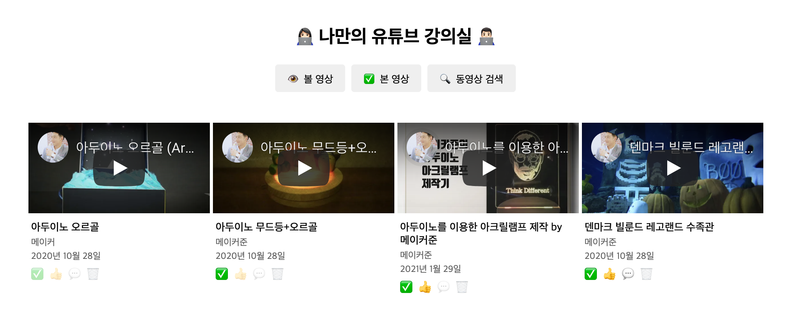

  

<h2 align="middle">나만의 유튜브 강의실</h2>

타입스크립트와 Youtube API를 이용해 SPA및 diff 알고리즘을 구현 한 나만의 유튜브 강의실

  
  
  
  
  

  <a href="https://my-youtube-classroom.netlify.app">🖥️ 데모 링크</a>

## 🔥 Projects!

  

## 프로젝트 목적

라이브러리 없이 현재 대중적으로 사용되고 있는 Frontend SPA 라이브러리들(React, Vue등)을 오마주하여 history 방식의 SPA 구현을 경험해보고 반응형 프로그래밍 방식과 간단한 diff 알고리즘을 함께 적용해보며 브라우저 렌더링 성능 개선을 경험해본다.

### 구현된 기능

- [유튜브 검색 API](https://developers.google.com/youtube/v3/getting-started?hl=ko)를 통해서, 내가 추가로 보고 싶은 영상들을 검색할 수 있다.
- 로딩컴포넌트: 데이터를 불러오는 중일 때, 현재 데이터를 불러오는 중임을 skeleton UI로 보여준다.
- 검색 결과가 없는 경우 결과 없음 이미지를 추가하여, 사용자에게 메시지를 보여준다.
- 최초 검색결과는 10개까지만 보여준다. 더 많은 데이터는 스크롤을 내릴 때 추가로 불러온다.
  - 검색 결과 화면에서 유저가 브라우저 스크롤 바를 끝까지 이동시켰을 경우, 그다음 10개 아이템을 추가로 api요청하여 불러온다.
- 내가 검색한 영상들의 json 데이터를 `저장`할 수 있다. (실제 저장이 아닌 영상 id를 Web Storage에 저장). 단 이미 저장된 경우는 저장 버튼이 보이지 않게 한다.
- 저장 가능한 최대 동영상의 갯수는 100개이다.
- 검색 모달에 다시 접근했을 때 가장 마지막에 검색한 키워드로 검색한 결과를 보여준다.
- 최근 검색 키워드를 3개까지 화면상에 검색창 하단에 보여준다.
- **Browser History Api**를 이용하여 SPA처럼 라우팅을 적용한다.
- 가장 처음에는 저장된 영상이 없음으로, 비어있다는 것을 사용자에게 알려주는 상태를 보여준다.
- 이후 페이지를 방문했을 때 기본 메인 화면은 내가 **볼 영상**들의 리스트를 보여준다.
- 영상 카드의 이모지 버튼을 클릭하여 아래와 같은 상태 변경이 가능해야 한다.
  - ✅ 본 영상으로 체크
  - 🗑️ 버튼으로 저장된 리스트에서 삭제할 수 있습니다. (삭제 시 사용자에게 정말 삭제할 것인지 물어봅니다.)
- 사용자가 버튼을 클릭했을 때 해당 행위가 정상적으로 동작하거나, 실패하였음을 `snackbar`를 통해 보여준다.
- 본 영상, 볼 영상 버튼을 눌러 필터링 할 수 있다.
- 👍 좋아요 버튼을 누른 데이터만 필터링해서 보여줄 수 있는 메뉴를 만든다.
  - 👍 좋아요 버튼을 누른 경우, 로컬에서 데이터를 변경한다.
  - 👍 좋아요 버튼을 다시 클릭해서 해지할 수 있어야 한다.

### 개선해야 할 사항

- 리스트 렌더링 된 데이터가 변경됐을때 diff 알고리즘 비정상 작동, react key prop같은 개념을 적용해야한다.
- 이미 불러왔던 유튜브 영상의 썸네일을 다른 라우트에 접근했다가 돌아오면 다시 불러오게 되는 현상이 있다.
